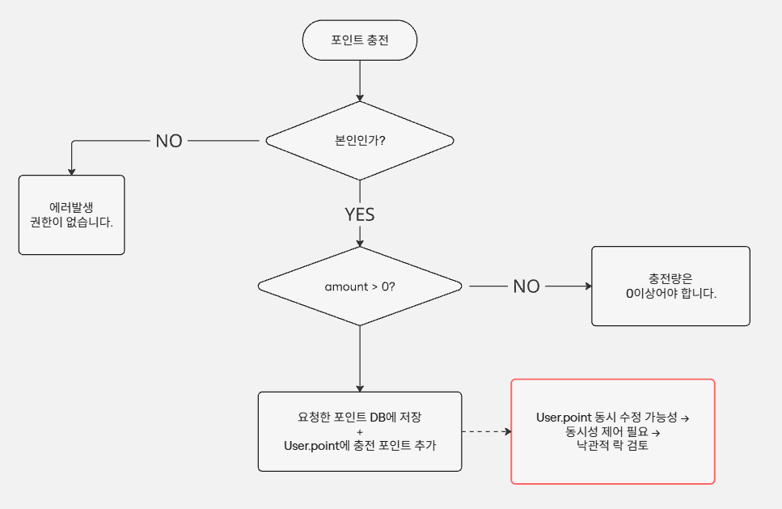
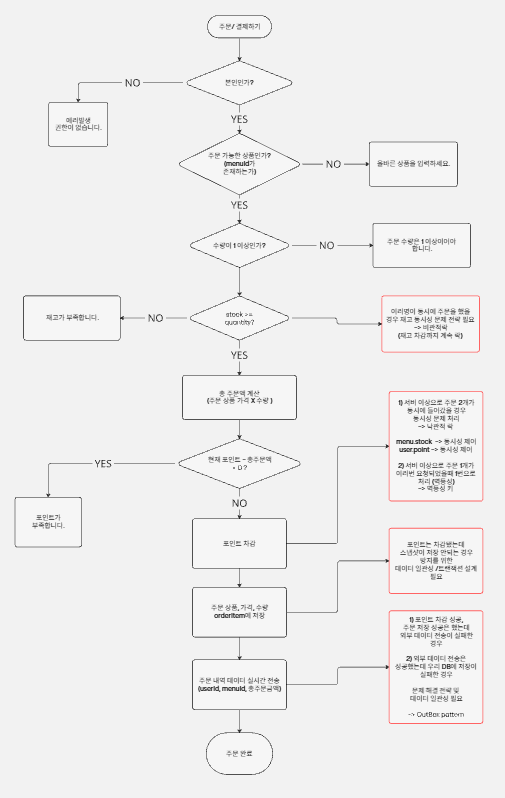
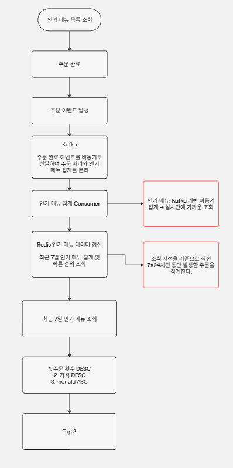

# ☕ Cafe System

다중 서버 환경에서 안정적인 주문 및 결제가 가능한 커피 주문 시스템

## 1. 프로젝트 소개

커피 메뉴 조회, 포인트 충전, 주문 및 결제, 인기 메뉴 조회 기능을 제공하는 커피 주문 시스템입니다.
단순한 CRUD 구현을 넘어 여러 서버 인스턴스에서 동시에 요청이 발생하는 상황을 고려하여 다음과 같은 문제를 해결하는 것을 목표로 합니다.

- 포인트 및 재고에 대한 동시성 제어
- 주문 과정에서의 데이터 일관성 보장
- 중복 주문 요청에 대한 멱등성 처리
- 다중 인스턴스 환경에서의 안정적인 동작
- Kafka와 Redis를 활용한 인기 메뉴 집계
- 외부 데이터 수집 플랫폼과의 데이터 연동

## 2. 주요 기능

### 2.1 메뉴 조회

등록된 커피 메뉴의 ID, 이름, 현재 판매 가격을 조회합니다.

### 2.2 포인트 충전

사용자가 포인트를 충전할 수 있으며, 충전 내역을 별도로 기록합니다.

- 1원 = 1P
- 현재 포인트 잔액 관리
- 포인트 충전 이력 관리

### 2.3 주문 및 결제

포인트를 이용하여 하나 이상의 메뉴를 주문하고 결제합니다.

- 주문 상품의 재고 확인
- 주문 금액 계산
- 포인트 잔액 확인 및 차감
- 주문 및 주문 상품 저장
- 주문 당시 상품 정보 스냅샷 저장
- 재고 차감
- 주문 완료 이벤트 발행

### 2.4 인기 메뉴 조회

최근 7일간의 주문 데이터를 기반으로 인기 메뉴 Top 3를 조회합니다.

주문 완료 이벤트를 Kafka로 전달하고 Consumer가 Redis의 인기 메뉴 집계 데이터를 갱신하는 구조를 사용합니다.

```text
주문 완료
   ↓
Kafka 이벤트 발행
   ↓
Kafka Consumer
   ↓
Redis 인기 메뉴 집계
   ↓
인기 메뉴 Top 3 조회
```

## 3. 프로젝트 설계

### 3.1 ERD

상세 ERD 및 테이블 설명은 아래 문서를 참고합니다.

- [ERD 및 테이블 설계](docs/erd.md)

### 3.2 기능별 플로우차트

주요 기능의 비즈니스 처리 흐름과 데이터 처리 과정을 플로우차트로 정리했습니다.

#### 포인트 충전



#### 주문 및 결제



#### 인기 메뉴 조회



### 3.23주요 데이터 설계

| 테이블         | 설명 |
|-------------|---|
| users       | 사용자 및 현재 포인트 잔액 관리 |
| menus       | 상품 및 현재 판매 가격, 재고 관리 |
| charges     | 포인트 충전 이력 관리 |
| orders      | 주문 정보 관리 |
| order_items | 주문 상품 및 주문 당시 상품 정보 스냅샷 관리 |

주문 상품은 현재 상품의 이름과 가격이 변경되더라도 과거 주문 정보를 유지할 수 있도록 주문 당시의 상품명과 가격을 스냅샷으로 저장합니다.

## 4. API 명세

프로젝트에서 제공하는 API의 요청/응답 형식과 상세 명세는 아래 문서에서 확인할 수 있습니다.

- [API 명세서](docs/api-spec.md)

## 5. 동시성 및 데이터 일관성

본 프로젝트는 단일 서버 환경뿐만 아니라 여러 서버 인스턴스에서 동시에 요청이 발생하는 상황을 고려합니다.

### 5.1 재고 동시성

동일 상품에 여러 주문이 동시에 요청될 수 있으므로 재고 데이터에 대한 동시성 제어가 필요합니다.

재고 차감 과정에서는 비관적 락을 활용하여 동시에 동일한 재고를 차감하는 상황을 제어합니다.

### 5.2 포인트 동시성

동일 사용자의 포인트에 여러 요청이 동시에 접근할 수 있으므로 포인트 잔액의 동시성 문제를 고려합니다.

포인트 변경 과정에서는 낙관적 락 등의 동시성 제어 전략을 적용하여 포인트가 잘못 차감되거나 충전되는 문제를 방지합니다.

### 5.3 트랜잭션

주문 과정에서 다음 작업은 하나의 논리적인 작업으로 처리되어야 합니다.

- 포인트 차감
- 재고 차감
- Order 저장
- OrderItem 저장

이 중 일부 작업만 성공하고 나머지가 실패하지 않도록 트랜잭션을 적용합니다.

포인트 충전 역시 다음 작업을 하나의 트랜잭션으로 처리합니다.

- Charge 저장
- User.point 증가

### 5.4 멱등성

네트워크 오류나 사용자의 중복 요청 등으로 동일한 주문 요청이 여러 번 전달될 수 있습니다.

이를 방지하기 위해 주문 요청에 대한 멱등성 처리를 적용하여 동일한 요청이 반복되더라도 실제 주문, 포인트 차감, 재고 차감은 한 번만 수행되도록 설계합니다.

## 6. 인기 메뉴 집계

인기 메뉴는 주문 완료 데이터를 기반으로 집계합니다.

주문 처리와 인기 메뉴 집계를 분리하여 주문 처리 과정의 부담을 줄이고 확장 가능한 구조를 구성합니다.

인기 메뉴의 집계 기준은 **상품 판매 수량이 아닌 주문 횟수**입니다.

예를 들어 한 주문에서 아메리카노 5잔을 주문하더라도 인기 메뉴 집계에서는 1회의 주문으로 계산합니다.

### 6.1 정렬 기준

1. 주문 횟수 내림차순
2. 주문 횟수가 동일하면 상품 가격 내림차순
3. 주문 횟수와 가격이 모두 동일하면 상품 ID 오름차순
4. 정렬된 결과 중 상위 3개 반환

## 7. 외부 데이터 수집 플랫폼 연동

주문 완료 후 외부 데이터 수집 플랫폼에 주문 이력을 전달합니다.

외부 시스템과의 통신은 자체 데이터베이스 트랜잭션과 별개의 작업이므로 데이터 정합성을 고려하여 비동기 처리 및 재처리 전략을 적용합니다.

주문 데이터와 외부 시스템 간의 데이터 불일치가 발생하지 않도록 이벤트 기반 구조와 멱등성 처리를 고려합니다.

상세 전략은 아래 문서를 참고합니다.

- [데이터 일관성 전략](docs/data-consistency.md)

## 8. 기술 스택

| 기술 | 사용 목적 |
|---|---|
| Java | 애플리케이션 개발 |
| Spring Boot | 애플리케이션 프레임워크 |
| Spring Data JPA | 데이터베이스 접근 및 ORM |
| MySQL | 주요 데이터 저장소 |
| Redis | 인기 메뉴 집계 및 조회 |
| Apache Kafka | 주문 완료 이벤트 전달 |
| Spring Boot Actuator | 애플리케이션 상태 및 모니터링 |
| Lombok | 보일러플레이트 코드 감소 |
| JUnit / Spring Test | 테스트 |
| K6 | 부하 및 동시성 테스트 |

## 9. 기술 선택 및 설계 문서

각 기술의 선택 이유와 구체적인 설계 전략은 별도의 문서로 관리합니다.

- [API 명세서](docs/api-spec.md)
- [비즈니스 규칙](docs/business-rules.md)
- [ERD 및 테이블 설계](docs/erd.md)
- [동시성 제어 전략](docs/concurrency.md)
- [데이터 일관성 전략](docs/data-consistency.md)
- [테스트 전략](docs/test-strategy.md)

## 10. 테스트 전략

본 프로젝트에서는 기능 정상 동작뿐만 아니라 동시성, 데이터 일관성, 멱등성 및 다중 인스턴스 환경을 검증합니다.

테스트는 다음과 같이 구분하여 작성합니다.

- 단위 테스트
- 통합 테스트
- 동시성 테스트
- Kafka / Redis 통합 테스트
- K6 부하 테스트
- 멀티 인스턴스 환경 테스트

상세 테스트 시나리오는 아래 문서를 참고합니다.

- [테스트 전략](docs/test-strategy.md)

## 11. 개발 목표

단순한 기능 구현을 넘어 다음과 같은 상황에서도 데이터 정합성을 유지하는 것을 목표로 합니다.

- 여러 사용자가 동시에 주문하는 상황
- 동일 사용자가 동시에 포인트를 사용하는 상황
- 동일 상품의 재고에 동시 접근하는 상황
- 동일한 주문 요청이 중복 전달되는 상황
- 여러 서버 인스턴스에서 동시에 요청이 처리되는 상황
- 주문 데이터와 외부 시스템의 데이터가 일시적으로 불일치하는 상황

이를 통해 동시성 제어, 트랜잭션, 이벤트 기반 아키텍처, 캐시 및 메시지 브로커를 실제 주문 시스템에 적용하고 검증합니다.